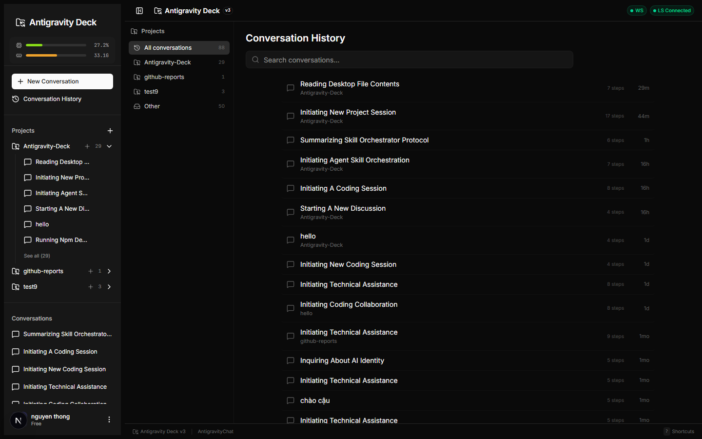
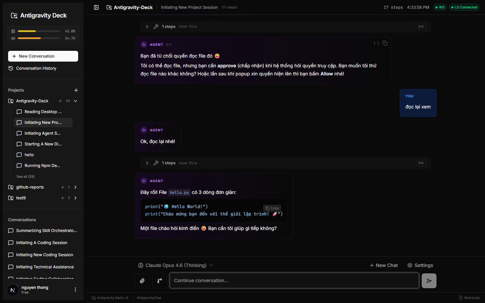
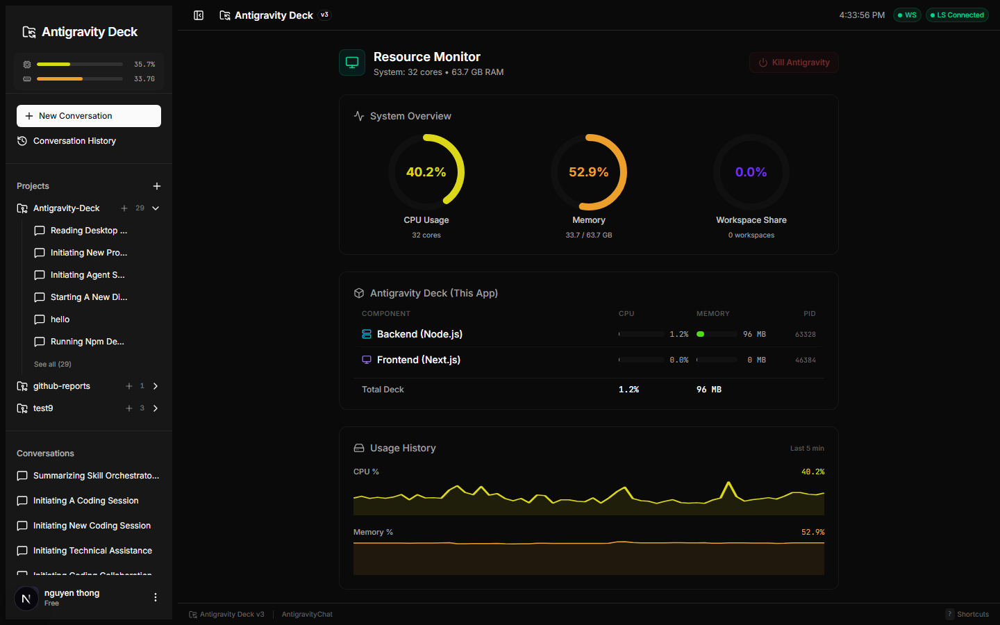
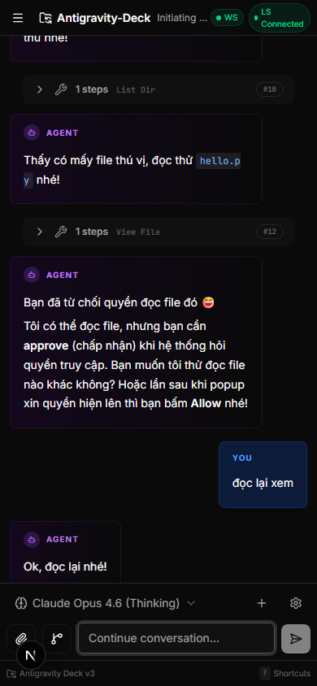

# 🔮 Antigravity Deck

Full-featured web dashboard for [Antigravity](https://antigravity.google). View, send, and manage AI conversations from any device — with a searchable all-time history across every project, live cascade control, resource monitoring, source control, IDE tools, and secure remote access.

> Built for **Antigravity 2.0.11+**, which runs a single shared **hub** Language Server. The Deck auto-detects the hub, tracks your workspaces on it, and streams full conversation history out of the IDE's Jetbox subsystem.

---

## 📸 Screenshots

| Conversation History | Conversation View |
|:-:|:-:|
|  |  |

| Resource Monitor | Mobile |
|:-:|:-:|
|  |  |

---

## ✨ Feature Highlights

### 🗂️ Conversation History & Projects
The landing view — your complete Antigravity history in one place.

- **All-time history** — Streams the complete conversation list (every project, not just the active few) from the IDE's **Jetbox** subsystem (`JetboxSubscribeToSummaries`)
- **Project grouping** — Conversations are organized by Antigravity Project, both in the history view (project filter tabs with counts) and in the sidebar (collapsible per-project groups)
- **Search & filter** — Filter history by project and search by title; each entry shows its project, step count, and age
- **Create & delete** — Start new conversations (globally or scoped to a project) and delete old ones, all from the UI

### 💬 Chat & Conversations
- **Send & receive** — Compose and send messages to Antigravity cascades directly from the web UI, with optimistic rendering of pending messages
- **Full step history** — Hybrid JSON + binary protobuf fetching bypasses the ~600-step JSON API limit, so the entire conversation loads (scroll up to page in older steps)
- **Real-time updates** — WebSocket-powered, with adaptive polling (faster while a cascade is active, slower when idle) plus streaming subscriptions to the LS (`StreamAgentStateUpdates` + cascade SSE) for instant state changes and "waiting for input" detection
- **All step types** — User input, agent responses, tool calls, code actions, commands, browser subagent, generated images, and 17+ more, each with its own rendering
- **Multi-image upload** — Attach images via file picker, clipboard paste (`Ctrl+V`), or drag-and-drop, with a thumbnail preview strip
- **Model selection** — Grouped model picker fetched live from the LS (quota bar, image-support icon, recommended badge)
- **Smart rendering** — Markdown with syntax highlighting, collapsible thinking blocks, step-type tags
- **Workflow autocomplete** — Suggests available slash-command workflows as you type `/`
- **Power features** — Step-detail slide-over, step bookmarks (`B`), timeline scrubber, analytics bar (step/token breakdown), token-usage view, Markdown export (`Ctrl+Shift+E`), and full keyboard shortcuts

### 🖥️ Workspace Management
Built for the 2.0.11 single-hub model — workspaces are tracked on the shared LS, not spun up as separate processes.

- **Auto-detection** — Discovers the running hub LS, its port, and CSRF token automatically (Windows / macOS / Linux), then builds a virtual instance per tracked workspace
- **Open & track folders** — Configure a default workspace root; existing subfolders appear as available workspaces and bind to the hub instantly via `AddTrackedWorkspace`
- **Launch the IDE** — Start Antigravity from the Deck when it isn't running
- **First-run onboarding** — Guided modal to set your workspace root on first launch

### ⚡ Cascade Control
- **Status tracking** — Running, idle, or waiting-for-user, per conversation
- **Permission gates** — When a cascade asks for permission (run a command, edit a file…), the Deck renders exactly the options the IDE offers — built dynamically from the step's `requestedInteraction` spec — so you can approve or reject from the web UI
- **Auto-accept** — Server-side mode that approves pending interactions across *all* running cascades (with workspace-boundary validation for file edits); read-only operations are always allowed
- **Cancel** — Stop an active cascade invocation
- **Token usage** — View generator metadata and token consumption

### 🧰 IDE Tools
Surfaced live from the IDE via the generic LS proxy.

- **MCP Servers** — View connected MCP servers, their tools, and connection status
- **Workflows** — Browse global and workspace workflows, skills, and rules
- **Memories** — List the IDE's stored knowledge items
- **Repo Info** — Workspace and git context for the active workspace

### 📊 Resource Monitor
Real-time system and per-process resource dashboard (5s sampling).

- **System overview** — CPU, RAM, and per-workspace share in animated donut charts
- **Per-workspace breakdown** — CPU% and memory for each LS process and its children
- **Self-monitoring** — Stats for the Deck's own backend (Node.js) and frontend (Next.js) processes, with PIDs
- **History sparklines** — CPU/RAM trends over a ~5-minute rolling window
- **Compact sidebar bar** — Mini CPU/RAM bars always visible in the sidebar (click to open the full dashboard)
- **Kill the IDE** — Terminate Antigravity from the dashboard via a confirm dialog
- **Cross-platform** — Windows (PowerShell) and macOS/Linux (ps) collectors

### 🔀 Source Control
Built-in read-only Git viewer with a file explorer.

- **Git status** — Modified, added, deleted, untracked, and renamed files with color-coded badges and per-file add/delete counts
- **Side-by-side diffs** — Powered by `@git-diff-view`, with syntax highlighting
- **File explorer** — Tree view of the workspace (skips `node_modules`, `.git`, `.next`, etc.)
- **Code viewer** — Syntax-highlighted file viewer for 30+ languages
- **Safe by design** — Git runs via argument arrays (no shell interpolation); file reads are path-validated against the workspace root

### 📜 Live Logs
- **Real-time backend log stream** — Watch the Deck server's own activity (detection, polling, cascade events) live from the dashboard, no terminal needed

### 👤 Profiles & Account
- **Multi-account** — Save multiple Antigravity profiles and swap between them (relaunches the IDE with the selected credentials). **Windows-only for now** — on macOS/Linux the API returns 501 and you should switch accounts inside the IDE
- **Account view** — Name, plan tier, avatar, and credit/quota bar

### 📱 Mobile & PWA
- **Instant resume** — The last steps and detection state are cached, so reopening on mobile shows data immediately with no loading flash
- **Smart reconnect** — WebSocket auto-reconnects in the background with a short grace period
- **Rich push notifications** — Web Push (VAPID) for cascade complete, waiting-for-user, error, and auto-accepted events, each individually toggleable
- **Installable** — Service worker + install prompt (Chrome/Android and iOS share-sheet instructions)

### 🔒 Security & Remote Access
- **API-key auth** — `AUTH_KEY` env var gates the API and WebSockets; the frontend shows a login form, and `?key=` URL params auto-authenticate then strip from history
- **Cloudflare Tunnel** — One command (`npm run online`) generates an auth key, builds the frontend, opens tunnels for backend + frontend, and prints a **QR code** with the auto-login URL embedded
- **Hardened** — Helmet security headers, rate limiting, request-log redaction, and workspace path validation to prevent traversal and command injection

### 🔌 Integrations & APIs
Headless integrations for driving Antigravity programmatically (no dashboard panel required).

- **External Agent API** — WebSocket + HTTP/SSE endpoints (`/api/agent/*`, `/ws/agent`) let any external AI agent open a session, send messages, and accept/reject — with concurrent sessions and per-session step limits
- **Discord bridge** — Optional `discord.js` bot relays a Discord channel to a live cascade (`/help`, `/listws`, `/setws`, @mention routing); auto-starts when configured
- **Generic LS proxy** — Call whitelisted Language Server methods via `POST /api/ls/:method`
- **API Tracker** — Local-only tooling (`tools/api-tracker/`) that captures, catalogs, and diffs the LS's Connect-RPC surface (600+ methods) so new IDE APIs can be wired in quickly
- **Orchestrator** *(experimental, API-only)* — Backend that splits a task into parallel subtasks (`/api/orchestrator/*`, `/ws/orchestrator`); no dashboard UI

### ⚙️ Settings
- **Default model** — Configure the preferred AI model for new cascades
- **Default workspace root** — Where new workspaces are opened from
- **Notification events** — Toggle which cascade events trigger push notifications, with a test button
- **Dark / Light theme** — Toggle from the sidebar menu

---

## 🚀 Quick Start

### ⚡ One-Command Setup (Recommended)

**No git or npm knowledge needed.** Paste one line — it clones, installs, and goes online with a shareable URL + QR code.

**Windows (PowerShell):**
```powershell
irm https://raw.githubusercontent.com/tysonnbt/Antigravity-Deck/main/scripts/setup.ps1 | iex
```

**macOS / Linux:**
```bash
curl -sL https://raw.githubusercontent.com/tysonnbt/Antigravity-Deck/main/scripts/setup.sh | bash
```

> **Prerequisites:** [Node.js 18+](https://nodejs.org/), [Git](https://git-scm.com/), and (for remote access) [cloudflared](https://developers.cloudflare.com/cloudflare-one/connections/connect-networks/downloads/). The setup script checks for these and guides you if anything is missing.

### 🗑️ Uninstall

Removes Antigravity Deck and stops any running instance automatically.

**Windows:**
```powershell
irm https://raw.githubusercontent.com/tysonnbt/Antigravity-Deck/main/scripts/uninstall.ps1 | iex
```

**macOS / Linux:**
```bash
curl -sL https://raw.githubusercontent.com/tysonnbt/Antigravity-Deck/main/scripts/uninstall.sh | bash
```

### 🛠️ Local Development

```bash
# Install backend + frontend dependencies and create settings.json
npm run setup

# Start backend (:3500) and frontend (:3000) together with hot-reload
npm run dev
```

Open **http://localhost:3000**.

### 🌐 Remote Access (Cloudflare Tunnel)

```bash
npm run online
```

Builds the frontend, starts the servers, opens tunnels for both, and **prints a QR code** with the auto-login URL embedded. Scan it on any device to open the app — no key entry needed.

### 🔑 With Authentication (local)

```bash
AUTH_KEY=your-secret-key npm run dev
```

---

## 📐 Architecture

```
┌────────────────────────┐  JSON + Binary Proto / streams  ┌───────────────┐
│   Antigravity Hub LS   │ ◄────────────────────────────── │   server.js   │
│  (single, shared,      │   Connect Protocol (HTTPS/HTTP) │   :3500 API   │
│   auto-detected)       │   Jetbox + AgentState streams   │   + WS hub    │
└────────────────────────┘                                  └──────┬────────┘
                                                                   │ WS (/ws) + HTTP
   ┌──────────────┐                                          ┌─────┴─────────┐
   │  Discord Bot │ ◄── /ws/agent + /api/agent (optional) ──│   Next.js     │
   │  / External  │                                         │   :3000 UI    │
   │  AI (opt.)   │                                         └───────────────┘
   └──────────────┘
```

- **Backend** (`server.js` + `src/`) — Express API proxy + 3 WebSocket servers (`/ws`, `/ws/agent`, `/ws/orchestrator`), adaptive poller, Jetbox history streams, AgentState streaming (`ls-stream.js`), resource monitor, hub detector, profile manager, and the agent/Discord/orchestrator subsystems. State is in-process plus `settings.json` (no database).
- **Frontend** (`frontend/`) — Next.js 16 (App Router) + React 19 + shadcn/ui + Tailwind CSS 4. The sidebar groups conversations by project; main panels: Conversation History (default), Chat, Source Control, Resources, Live Logs, MCP Servers, Workflows, Memories, Repo Info, Account, and Settings.

---

## ⚡ Tech Stack

| Layer | Technology |
|-------|-----------|
| Backend | Node.js 18+ · Express 4 |
| WebSocket | ws 8 (UI / agent / orchestrator) |
| Validation | Zod 4 |
| Security | Helmet 8 · express-rate-limit 8 |
| Protobuf | protobufjs 8 |
| Push | web-push (VAPID) |
| Discord | discord.js 14 |
| Frontend | Next.js 16 (Turbopack) · React 19 |
| Components | shadcn/ui (Radix UI) · lucide-react |
| Styling | Tailwind CSS 4 |
| Markdown | react-markdown · remark-gfm · rehype-highlight |
| Diffs | @git-diff-view · diff2html |
| Language | TypeScript 5 (FE) · JavaScript (BE) |
| Tunnel | cloudflared |

---

## 🙏 Acknowledgments

Thanks to the **Claudible** community for AI quota support and testing 💜

---

## 📄 License

MIT
